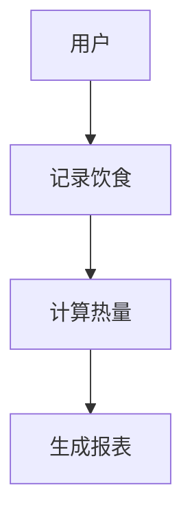

# Week 02 作业记录

## 项目选题
**最终选题**：个人健康饮食记录管理系统

## 确定过程
    原因如下：
   业务场景贴近生活，需求清晰，容易理解。
   数据模型丰富（食物、营养、运动、身体数据），适合数据库设计练习。
   天然多角色（用户、营养师、管理员），适合认证与权限课程。
   功能模块边界清晰，极易拆分为微服务（用户、记录、分析、消息）。
   后续可扩展性强，可引入 AI 识别、智能推荐等高级功能。

## 本周完成内容
确定项目题目与业务背景
梳理目标用户与需求
完成功能模块划分
绘制核心业务流程图
编写 README 初稿
规划后续微服务演进方向

## 后续计划
Week 03：数据库设计与 ER 图
Week 04：后端项目搭建与用户认证
Week 05：饮食记录模块开发
Week 06：运动记录与报表模块